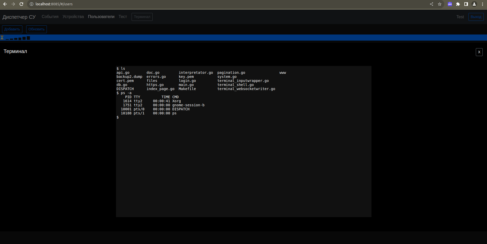

# Web-Console для Linux



В браузере открывается консоль, подключенная к /bin/bash работающему виртуальному терминалу на стороне сервера.

В файле main.go вместо /bin/bash можно указать путь к другому приложению.

Написан на Go и Java Script.

Статус проекта: Завершен.


```bash
# Build
$ make

# Run
$ ./demo

# Затем открыть в браузере страницу http://localhost:5000 
```

2023 Evgeny Goryachev    
Gor.Com 


